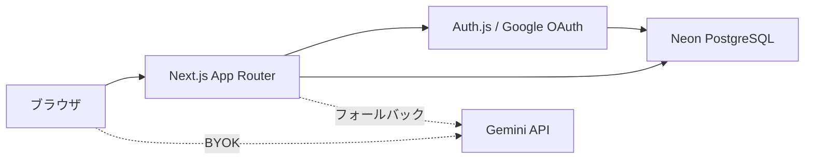

# Markdown Memory

Claude / ChatGPT / Gemini が生成した Markdown を保存し、どの端末からでも見返し・編集・共有できる個人用ハブ。

AI-Driven School 第7回課題（4ヶ月目）の提出物。旧 Vite + Firebase 構成から **Next.js 16 + Neon Postgres + Auth.js + Vercel** へ全面移行済み。

**本番 URL**: https://markdown-memory.vercel.app

---

## できること

| 機能            | 説明                                                                           |
| --------------- | ------------------------------------------------------------------------------ |
| Google ログイン | Auth.js v5 + Drizzle アダプタ。ユーザー情報は DB に永続化                      |
| Markdown 管理   | `.md` のアップロード（D&D 対応）・新規作成・プレビュー・編集                   |
| フォルダ整理    | 階層フォルダでファイルを分類                                                   |
| 自動保存        | 編集はデバウンス保存。ファイル切替・プレビュー切替時にフラッシュ               |
| 公開共有        | ファイルごとにランダムトークン URL を発行。ログイン不要の読み取り専用          |
| AI 再投入       | 本文コピー + Claude / ChatGPT / Gemini を新規タブで開く                        |
| アプリ内 AI     | BYOK（Gemini API キーを localStorage に保存）。要約・整形プリセット + 自由指示 |

---

## 画面構成（4ペイン）

```
┌─────────────┬──────────────┬────────────────────┬─────────────────┐
│  Pane 1     │  Pane 2      │  Pane 3            │  Pane 4         │
│  フォルダ   │  ファイル    │  プレビュー ⇄ 編集 │  詳細・アクション│
│  ツリー     │  一覧        │  （自動保存）      │  共有 / AI 等   │
└─────────────┴──────────────┴────────────────────┴─────────────────┘
```

- 小画面では Pane 1 を非表示にし、横スクロールで操作可能
- 未ログイン時は `/login` へリダイレクト
- 共有ページは `/share/[token]`（認証不要）

---

## 技術スタック

| 層                  | 採用技術                                                   |
| ------------------- | ---------------------------------------------------------- |
| フロント / サーバー | Next.js 16, React 19, TypeScript（strict）                 |
| UI                  | Tailwind CSS v4, shadcn/ui（base-nova / `@base-ui/react`） |
| DB                  | Neon PostgreSQL + Drizzle ORM                              |
| 認証                | Auth.js v5（NextAuth）+ Google OAuth                       |
| Markdown 表示       | react-markdown + remark-gfm                                |
| AI                  | Google Gemini API（BYOK / サーバー側フォールバック任意）   |
| ホスティング        | Vercel                                                     |

---

## データの保存先

| 保存するもの                      | 置き場所                              | 理由                                                                    |
| --------------------------------- | ------------------------------------- | ----------------------------------------------------------------------- |
| Markdown 本文・フォルダ・共有設定 | Neon（`document`, `folder` テーブル） | リロードしても消えない。別端末・共有 URL から同じデータにアクセスできる |
| ログインユーザー                  | Neon（`user`, `account` テーブル）    | どの端末からログインしても同一人物として扱える                          |
| セッション                        | JWT Cookie                            | Edge で DB を引かずに認証できる                                         |
| Gemini API キー（BYOK）           | ブラウザ `localStorage`               | ユーザーの鍵をサーバーに預けない                                        |
| スキーマ定義                      | リポジトリ（`lib/db/schema.ts`）      | AI が指示なしで設計を読める SSoT（ハーネス）                            |

---

## ローカル開発

### 1. クローンと依存関係

```bash
git clone https://github.com/ViNi-77/Markdown-Memory.git
cd Markdown-Memory
npm install
```

### 2. 環境変数

`.env.example` をコピーして `.env.local` を作成する。

```bash
cp .env.example .env.local
```

| 変数                 | 必須 | 説明                                             |
| -------------------- | ---- | ------------------------------------------------ |
| `DATABASE_URL`       | ✅   | Neon の接続文字列（pooler URL 推奨）             |
| `AUTH_SECRET`        | ✅   | `npx auth secret` で生成                         |
| `AUTH_GOOGLE_ID`     | ✅   | Google Cloud Console の OAuth クライアント ID    |
| `AUTH_GOOGLE_SECRET` | ✅   | 同上のクライアントシークレット                   |
| `GEMINI_API_KEY`     | 任意 | サーバー側フォールバック用。未設定なら BYOK のみ |

### 3. データベース

```bash
npm run db:push    # スキーマを Neon に反映
# npm run db:studio  # Drizzle Studio で中身を確認
```

### 4. Google OAuth（ローカル）

[Google Cloud Console](https://console.cloud.google.com/) で Web アプリケーションの OAuth クライアントを作成し、以下を登録する。

**Authorized JavaScript origins**

```
http://localhost:3000
```

**Authorized redirect URIs**

```
http://localhost:3000/api/auth/callback/google
```

OAuth 同意画面が「テスト」モードの場合、ログインする Google アカウントをテストユーザーに追加する。

### 5. 起動

```bash
npm run dev
```

`http://localhost:3000` を開き、Google でサインインする。

---

## Vercel へのデプロイ

1. GitHub リポジトリを Vercel に接続する
2. Vercel Storage から Neon を追加し、`DATABASE_URL` を環境変数に設定する
3. 以下を Production 環境変数に追加する

```
AUTH_SECRET
AUTH_GOOGLE_ID
AUTH_GOOGLE_SECRET
AUTH_URL=https://<your-domain>.vercel.app
NEXTAUTH_URL=https://<your-domain>.vercel.app
```

4. Google Cloud Console の同じ OAuth クライアントに **本番 URL も追加**する（ローカルだけでは本番ログインできない）

**Authorized JavaScript origins**

```
https://<your-domain>.vercel.app
```

**Authorized redirect URIs**

```
https://<your-domain>.vercel.app/api/auth/callback/google
```

5. `git push` で自動デプロイ、または `vercel --prod` で手動デプロイ

---

## 開発コマンド

| コマンド              | 役割                              |
| --------------------- | --------------------------------- |
| `npm run dev`         | 開発サーバー起動                  |
| `npm run build`       | 本番ビルド                        |
| `npm run start`       | 本番サーバー起動                  |
| `npm run lint`        | ESLint                            |
| `npm run test`        | Vitest スモークテスト             |
| `npm run format`      | Prettier で整形                   |
| `npm run db:generate` | Drizzle マイグレーション SQL 生成 |
| `npm run db:push`     | スキーマを DB に反映              |
| `npm run db:migrate`  | マイグレーション実行              |
| `npm run db:studio`   | Drizzle Studio 起動               |

---

## ディレクトリ構成

```
app/
  page.tsx                    認証ガード付きワークスペース
  login/page.tsx              Google サインイン
  share/[token]/page.tsx      公開共有（読み取り専用）
  api/auth/[...nextauth]/     Auth.js エンドポイント
  api/ai/route.ts             Gemini プロキシ（BYOK 未設定時のフォールバック）
auth.ts                       Auth.js 設定
components/
  markdown/                   Markdown Memory 本体 UI
    MarkdownWorkspace.tsx     4ペイン統合
    MarkdownView.tsx          Markdown レンダラ
    AiAssistPanel.tsx         アプリ内 AI パネル
  auth/UserButton.tsx         ユーザー表示・サインアウト
  ui/                         shadcn 部品
lib/
  db/schema.ts                DB スキーマ SSoT
  db/index.ts                 Drizzle クライアント
  data.ts                     サーバー側データ取得
  actions.ts                  Server Actions（CRUD・共有）
  ai.ts                       AIリクエスト検証・プロンプト生成
  ai-handoff.ts               外部 AI サービス URL
drizzle/                      マイグレーション SQL
```

---

## 品質方針

このリポジトリは Markdown Memory 本体に集中するため、旧採用管理ワークスペース雛形のコード・サンプルデータ・テストを削除済みです。今後の変更では、Markdown 管理、認証、共有、AI補助に直接関係するコードだけを残し、迷いのない構成を維持します。

- 不要なドメインコードを残さない
- Server Actions は所有者チェックと失敗時の明示エラーを徹底する
- AI API は純粋関数で入力検証・プロンプト生成をテストする
- 主要画面は Vitest / Testing Library で退行を検知する

---

## アーキテクチャ概要



- **読み取り**: Server Component が `auth()` で認証確認 → `getWorkspaceData()` で DB から取得
- **書き込み**: Client Component から Server Actions（`lib/actions.ts`）経由で DB 更新
- **共有**: `shareToken` で `/share/[token]` にルーティング。`isPublic` が true のドキュメントのみ表示

---

## よくあるつまずき

### 本番で Google ログインが「リクエストは無効です」

Google Cloud Console の OAuth クライアントに **本番の redirect URI** が登録されていない。上記「Vercel へのデプロイ」の手順 4 を確認。

### ローカルは動くが本番だけ失敗する

Vercel の環境変数（`AUTH_SECRET`, `DATABASE_URL`, `AUTH_GOOGLE_*`, `AUTH_URL`）が Production に設定されているか確認。

### 共有リンクが `localhost` になる

本番デプロイ後は `window.location.origin` を使うため、本番 URL で共有を有効化し直す。

---

## ライセンス / 課題

AI-Driven School の課題提出物。提出物のフォーマット・期限は受講生ポータルを参照。
