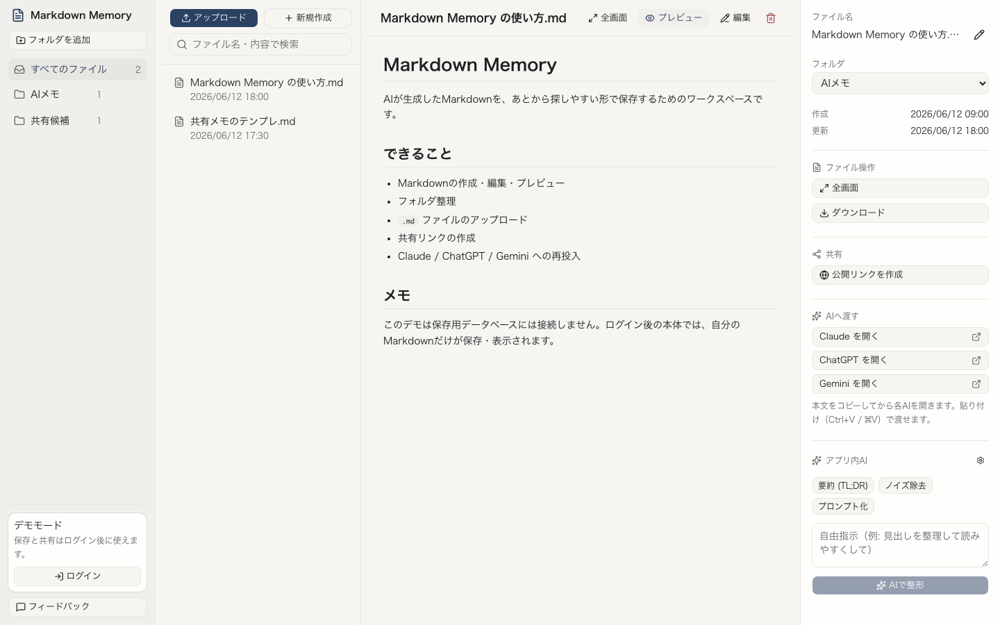
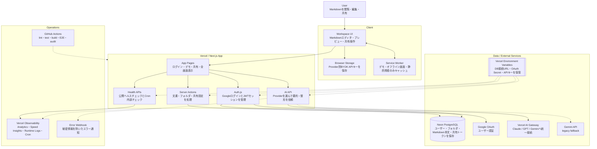

# Markdown Memory

[](https://github.com/ViNi-77/Markdown-Memory/actions/workflows/ci.yml)


> AIが生成したMarkdownを、あとから探しやすい形で保存・整理・編集・共有するための個人用Markdownワークスペース。

| Production                           | Demo                                      | Repository                                   |
| ------------------------------------ | ----------------------------------------- | -------------------------------------------- |
| <https://markdown-memory.vercel.app> | <https://markdown-memory.vercel.app/demo> | <https://github.com/ViNi-77/Markdown-Memory> |



## Portfolio Snapshot

Markdown Memory は、AIチャットで生まれたMarkdownを「その場限り」にせず、保存・整理・共有・再利用できる形へ戻すためのWeb/PWAです。

個人開発のポートフォリオとして、単なる静的デモではなく、ログイン、DB保存、共有URL、AI Provider切替、PWA、Production運用、Privacy / Terms、アカウント削除までを一つのプロダクトとして通しています。

| 観点         | 内容                                                                                      |
| ------------ | ----------------------------------------------------------------------------------------- |
| ユーザー価値 | AIが生成したMarkdownを、あとから探し、読み、編集し、共有し、別のAIへ渡せる                |
| 実装範囲     | Next.js App Router、Auth.js、Neon PostgreSQL、Drizzle、Vercel AI Gateway、PWA、Vercel運用 |
| 安全性       | 非公開MarkdownをService Workerでキャッシュしない。Provider APIキーはブラウザ保存のみ      |
| 公開品質     | CI、E2E、Production smoke、Apple Safari実機確認、Runtime Logs確認まで実施済み             |
| 現在地       | Season 1 Phase 14完了。次はPhase 15でiOS TestFlight用の最小ネイティブshell検証へ進む      |

## 見どころ

| 見どころ         | 具体例                                                                                 |
| ---------------- | -------------------------------------------------------------------------------------- |
| 実用導線         | 作成、編集、自動保存、リロード復元、フォルダ整理、共有、解除、削除まで一連で操作できる |
| AI UX            | Claude / GPT / Gemini を切り替え、Provider別APIキー、AI提案の追記・置き換え確認を扱う  |
| モバイル/PWA     | iPhone Safariでホーム画面追加、アプリ表示、下部ナビ、オフライン案内を確認済み          |
| 公開運用         | `/api/health`、Cron保護、Vercel Analytics / Speed Insights / Runtime Logs を用意       |
| ポートフォリオ性 | READMEからProduction、Demo、技術構成、確認状況、今後のTestFlight計画まで追える         |

## できること

| 機能            | 内容                                                                                 |
| --------------- | ------------------------------------------------------------------------------------ |
| Markdown管理    | 作成、編集、プレビュー、アップロード、ダウンロード                                   |
| フォルダ整理    | Markdown ファイルをフォルダで整理                                                    |
| 自動保存        | 編集内容をデバウンス保存                                                             |
| 共有            | 選択したファイルだけ公開リンクを発行                                                 |
| AI連携          | Claude / ChatGPT / Gemini に本文をコピーして開く                                     |
| アプリ内AI      | Claude / GPT / Gemini モード、Provider別キー保存、提案の追記・置き換え確認・一時履歴 |
| Markdown表示    | CommonMark + GFM を安全に表示。表、脚注、コードブロック、通常改行にも対応            |
| 全画面表示      | ログイン後、自分の Markdown を別ウィンドウで閲覧                                     |
| ペイン調整      | デスクトップでフォルダ、ファイル一覧、詳細ペインの幅を調整                           |
| デモ            | `/demo` で未ログインのまま操作感を確認                                               |
| スマホ操作      | 本文閲覧へ誘導し、下部ナビの現在地表示、選択中ファイルへの復帰も提供                 |
| PWA品質         | manifest、PNGアイコン、オフラインページ、限定的 Service Worker、スマホ読書面         |
| 運用監視        | Vercel Analytics / Speed Insights / Runtime Logs / Cron / Webhook                    |
| Privacy / Terms | データの保存先、AIキー、共有リンク、利用条件を公開ページで確認                       |
| データ削除      | アカウント設定からアカウントと保存済みMarkdownデータを削除                           |
| フィードバック  | GitHub Issues への導線。スマホ下部にも送信リンクを表示                               |

## Markdown 表示仕様

Markdown Memory の表示は、CommonMark を基本に GitHub Flavored Markdown（GFM）を加えた構成です。GitHubでよく使う表、チェックリスト、取り消し線、脚注、自動リンク、GitHub風アラートを読みやすく表示します。

段落内の通常改行は、プレビュー上でも読みやすい改行として表示します。AIが出力したワークフロー、手順、縦並びのメモを、編集画面に近い形で確認できます。

コードブロックは言語ラベルとコピー操作を表示します。AIが生成したコードや設定例を、スマホでも確認しやすい形で扱うための表示です。

表とコードブロックは、スマホ幅でも本文全体を横に押し広げず、要素単位で横スクロールします。長いURLや長いコード行があっても、読み進める画面全体は縦スクロールを保ちます。

安全性のため、Markdown本文に書かれた raw HTML は実行可能なHTMLとして扱いません。共有ページでも同じ表示方針です。

## システム構成

READMEでは C4 Model の Container Diagram に近い粒度で、ユーザー操作、アプリ本体、外部サービス、運用監視の役割が分かるように整理しています。



### 主要コンポーネント

| Component                    | 役割                                                                             |
| ---------------------------- | -------------------------------------------------------------------------------- |
| Browser / PWA                | Markdownの閲覧・編集・共有。Provider別BYOK APIキーはlocalStorageに保存           |
| Service Worker               | `/demo`、`/offline`、PWAアイコン、静的資産のみキャッシュ。非公開Markdownは対象外 |
| Next.js App on Vercel        | 画面、Server Actions、API Routes、共有ページ、全画面表示を提供                   |
| Auth.js                      | Google OAuth と JWT セッションを管理                                             |
| Drizzle ORM                  | Neon PostgreSQL への型付きアクセス                                               |
| Neon PostgreSQL              | ユーザー、フォルダ、文書、共有トークンを保存                                     |
| Vercel AI Gateway            | Claude / GPT / Gemini への統一接続、モデル指定、BYOK、利用ログ                   |
| Gemini API                   | Geminiモードの既存APIキー互換 fallback                                           |
| Vercel Environment Variables | DB接続URL、OAuth Secret、APIキー、CRON_SECRETを保管                              |
| GitHub Actions               | lint / test / build / E2E / audit を実行                                         |
| Vercel Observability         | Analytics、Speed Insights、Runtime Logs、Cron、Webhookで運用確認                 |

### 主要フロー

| Flow       | 経路                                                     | 補足                                                                        |
| ---------- | -------------------------------------------------------- | --------------------------------------------------------------------------- |
| Login      | Browser → Auth.js → Google OAuth                         | セッションはJWTで管理                                                       |
| Save       | Browser → Server Actions → Drizzle ORM → Neon PostgreSQL | Markdown本文・フォルダ・共有状態を保存                                      |
| AI Assist  | Browser → AI API → Vercel AI Gateway / Gemini fallback   | Claude / GPT / Gemini を切り替え。Provider別BYOKキーまたはGateway設定を使用 |
| Share      | Browser → Server Actions → `/share/[token]`              | 公開リンクを知っている人だけが閲覧可能                                      |
| Monitoring | Vercel Cron → Cron Health API → Runtime Logs / Webhook   | `CRON_SECRET` で内部ヘルスチェックを保護                                    |

## データ保護方針

このアプリはローカル専用ではありません。ログイン後に作成したデータは、設定された Neon PostgreSQL に保存されます。

| 対象                            | 扱い                                                                     |
| ------------------------------- | ------------------------------------------------------------------------ |
| ユーザー情報・認証情報          | Neon PostgreSQL / Auth.js Cookie に保存                                  |
| フォルダ                        | Neon PostgreSQL に保存                                                   |
| Markdown本文                    | Neon PostgreSQL に保存                                                   |
| 共有リンクの公開状態とトークン  | Neon PostgreSQL に保存                                                   |
| BYOKのProvider APIキー          | ブラウザの `localStorage` にProvider別で保存                             |
| AI提案の一時履歴                | 画面を開いている間だけ保持。DB / `localStorage` には保存しない           |
| AI Gateway / legacy Gemini 設定 | Vercel Environment Variables に保存                                      |
| DB接続URL・OAuth Secret         | Vercel Environment Variables に保存                                      |
| 非公開Markdown                  | Service Workerでキャッシュしない。初期PWAでは端末に永続保存しない        |
| 共有ページ                      | Service Workerでキャッシュしない。受信側端末への自動保存もしない         |
| デモ画面の編集内容              | DBには保存しない。ページ再読み込みで初期化。                             |
| アカウント削除                  | `user` 行を削除し、Auth.js連携・フォルダ・Markdown・共有リンクを連鎖削除 |

共有リンクを発行した Markdown は、URL を知っている人が閲覧できます。公開したくない内容では共有リンクを作成しないでください。

Privacy と Terms は `/privacy` と `/terms` で確認できます。ログイン後のアカウント設定では、このブラウザに保存されたProvider APIキーだけを削除する操作と、アカウント全体を削除する操作を分けています。

## 技術構成

- Next.js 16 App Router
- React 19
- TypeScript
- Tailwind CSS v4
- shadcn/ui
- Auth.js v5
- Neon PostgreSQL
- Drizzle ORM
- Vercel AI Gateway / Google Gemini API fallback
- Vercel

## 確認済み品質

| 項目             | 状態                                                                                           |
| ---------------- | ---------------------------------------------------------------------------------------------- |
| CI品質ゲート     | `format:check`、`lint`、`test`、`build`、`test:e2e` がmainで通過                               |
| Production smoke | `/api/health`、`/demo`、`/privacy`、`/terms`、`/api/cron/health` の保護を確認                  |
| Apple Safari     | ホーム画面追加、アプリ表示、ログイン後導線、保存、共有、AI、オフライン案内を実機確認済み       |
| PWA              | manifest、PNG / Apple touch icon、`apple-mobile-web-app-capable`、限定Service Workerを確認済み |
| 秘密情報露出     | Runtime Logsで想定外500、APIキー、DB URL、Markdown全文の露出がないことを確認                   |
| Android Chrome   | Season 1では確認対象外。Apple端末を対象に品質確認                                              |

## 主なルート

| ルート                    | 内容                                 |
| ------------------------- | ------------------------------------ |
| `/`                       | ログイン後の Markdown ワークスペース |
| `/login`                  | Google ログイン画面                  |
| `/demo`                   | 未ログインで確認できるデモ画面       |
| `/share/[token]`          | 公開共有された Markdown の閲覧画面   |
| `/view/[id]`              | ログイン済みユーザー向けの全画面閲覧 |
| `/offline`                | オフライン時の案内画面               |
| `/privacy`                | データの扱いと削除方針               |
| `/terms`                  | 利用条件と注意点                     |
| `/api/health`             | 本番監視用の軽量ヘルスチェック       |
| `/api/cron/health`        | Vercel Cron 用の内部ヘルスチェック   |
| `/api/auth/[...nextauth]` | Auth.js の認証エンドポイント         |
| `/api/ai`                 | アプリ内AI用のサーバーエンドポイント |

## ローカル起動

```bash
npm install
cp .env.example .env.local
npm run dev
```

ローカル URL:

```text
http://localhost:3000
```

## 必要な環境変数

```text
DATABASE_URL
AUTH_SECRET
AUTH_GOOGLE_ID
AUTH_GOOGLE_SECRET
GEMINI_API_KEY
GEMINI_MODEL
AI_GATEWAY_API_KEY
AI_MODEL_CLAUDE
AI_MODEL_GPT
AI_MODEL_GEMINI
ERROR_REPORT_WEBHOOK_URL
CRON_SECRET
```

アプリ内AIは Claude / GPT / Gemini を切り替えできます。Production では Vercel AI Gateway の OIDC または `AI_GATEWAY_API_KEY` を使い、必要に応じて Vercel 側の BYOK を設定します。ユーザーが画面で入力したProvider APIキーはブラウザにのみ保存され、AI実行時だけ送信されます。AI提案を本文へ反映する場合、追記はそのまま実行し、本文置き換えは確認してから保存します。AI提案の一時履歴は画面を開いている間だけ保持し、DBや `localStorage` には保存しません。
`GEMINI_API_KEY` と `GEMINI_MODEL` は Geminiモードの legacy fallback 用で任意です。
`ERROR_REPORT_WEBHOOK_URL` も任意です。設定すると、本文やAPIキーを含まないサーバーエラー通知をHTTPS Webhookへ送ります。
`CRON_SECRET` は Vercel Cron の内部ヘルスチェック保護用です。

OAuth、Vercel、Production 確認、バックアップなどの運用手順は [`docs/MAINTAINERS.md`](docs/MAINTAINERS.md) に集約しています。

## チェックコマンド

公開前に以下を実行します。

```bash
npm run lint
npm test
npm run build
npm run format:check
npm run test:e2e
```

E2E は Playwright を使い、`/demo` の作成・編集・プレビューを確認します。

初回だけブラウザを入れる場合があります。

```bash
npx playwright install chromium
```

## 開発フロー

`main` に直接変更を入れず、ブランチと Pull Request を使います。

1. `main` から作業ブランチを作る
2. ブランチで実装する
3. ローカルでチェックコマンドを実行する
4. Pull Request を作る
5. GitHub Actions と Vercel Preview を確認する
6. 問題がなければ `main` にマージする
7. Vercel Production を確認する

Pull Request の説明やコメントは日本語で記載します。

## メンテナンス

このリポジトリは public です。運用・リリース・本番確認の詳細は、初見ユーザー向け README からは分けて [`docs/MAINTAINERS.md`](docs/MAINTAINERS.md) に置いています。

公開 Issue、PR、スクリーンショットには、APIキー、DB接続URL、OAuth Secret、個人情報、非公開Markdown本文を含めません。Production スモークで作ったテスト用ファイルや共有リンクは、確認後に削除または非公開へ戻します。

## Roadmap

Season 1 は、Web/PWAとして完成度を高めたうえで iOS TestFlight の内部配布まで到達することをゴールにします。Phase 10A は Season 1 の途中成果であり、Season 1 の完了ではありません。App Store本番公開、App Store審査対策としてのiOS固有価値追加、Macアプリ化は Season 2 以降で扱います。

| Phase | Season   | 状態     | 内容                                                         |
| ----- | -------- | -------- | ------------------------------------------------------------ |
| 1-10A | Season 1 | 完了済み | Web/PWAのMVP、保存、共有、AI、PWA品質、Production確認        |
| 11    | Season 1 | 完了     | Season 1ゴール再定義、Roadmap/docs更新                       |
| 12    | Season 1 | 完了     | Privacy / Terms / アカウント削除 / データ削除導線            |
| 13    | Season 1 | 完了     | Web/PWA最終品質、Apple Safari実機、Production smoke          |
| 14    | Season 1 | 完了     | README中心のポートフォリオ仕上げ                             |
| 15    | Season 1 | 未着手   | iOS TestFlight用の最小ネイティブshell検証                    |
| 16    | Season 1 | 未着手   | TestFlight内部配布、実機確認、Season 1完了記録               |
| 17+   | Season 2 | 後続     | App Store審査対策、iOS固有価値追加、App Store本番公開、Mac化 |

Season 1 の詳細な完了条件は [`docs/SEASON1_ROADMAP.md`](docs/SEASON1_ROADMAP.md) にまとめています。Phase ごとの確認記録と本番スモークの進め方は [`docs/MAINTAINERS.md`](docs/MAINTAINERS.md) から参照します。

## リポジトリに置かないもの

以下はコミットしません。

- `.env.local`
- `.vercel`
- 実値入りの API キー、OAuth Secret、DB 接続 URL
- DB バックアップファイル
- `.agents`
- `.antigravity`
- `.claude`
- ローカルの作業ログや一時ファイル
