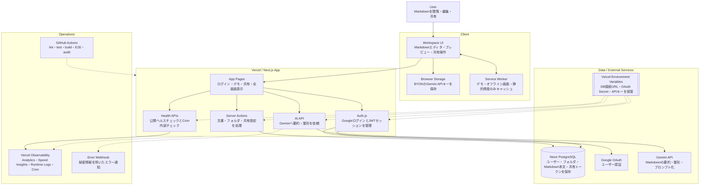

# Markdown Memory

[](https://github.com/ViNi-77/Markdown-Memory/actions/workflows/ci.yml)


> AIが生成したMarkdownを、あとから探しやすい形で保存・整理・編集・共有するための個人用Markdownワークスペース。

| Production                           | Demo                                      | Repository                                   |
| ------------------------------------ | ----------------------------------------- | -------------------------------------------- |
| <https://markdown-memory.vercel.app> | <https://markdown-memory.vercel.app/demo> | <https://github.com/ViNi-77/Markdown-Memory> |


## できること

| 機能           | 内容                                                              |
| -------------- | ----------------------------------------------------------------- |
| Markdown管理   | 作成、編集、プレビュー、アップロード、ダウンロード                |
| フォルダ整理   | Markdown ファイルをフォルダで整理                                 |
| 自動保存       | 編集内容をデバウンス保存                                          |
| 共有           | 選択したファイルだけ公開リンクを発行                              |
| AI連携         | Claude / ChatGPT / Gemini に本文をコピーして開く                  |
| アプリ内AI     | Gemini API による要約・整形。BYOK またはサーバー側キーを使用      |
| 全画面表示     | ログイン後、自分の Markdown を別ウィンドウで閲覧                  |
| ペイン調整     | フォルダ、ファイル一覧、詳細ペインの幅を調整                      |
| デモ           | `/demo` で未ログインのまま操作感を確認                            |
| モバイル前段   | スマホ幅で一覧・本文・詳細へ移動できる導線を用意                  |
| PWA下地        | manifest、アイコン、オフラインページ、限定的 Service Worker       |
| 運用監視       | Vercel Analytics / Speed Insights / Runtime Logs / Cron / Webhook |
| フィードバック | GitHub Issues への導線。スマホ下部にも送信リンクを表示            |

## システム構成

READMEでは C4 Model の Container Diagram に近い粒度で、ユーザー操作、アプリ本体、外部サービス、運用監視の役割が分かるように整理しています。



### 主要コンポーネント

| Component                    | 役割                                                                 |
| ---------------------------- | -------------------------------------------------------------------- |
| Browser / PWA                | Markdownの閲覧・編集・共有。BYOKのGemini APIキーはlocalStorageに保存 |
| Service Worker               | `/demo`、`/offline`、静的資産のみキャッシュ。非公開Markdownは対象外  |
| Next.js App on Vercel        | 画面、Server Actions、API Routes、共有ページ、全画面表示を提供       |
| Auth.js                      | Google OAuth と JWT セッションを管理                                 |
| Drizzle ORM                  | Neon PostgreSQL への型付きアクセス                                   |
| Neon PostgreSQL              | ユーザー、フォルダ、文書、共有トークンを保存                         |
| Gemini API                   | Markdownの要約・整形・プロンプト化                                   |
| Vercel Environment Variables | DB接続URL、OAuth Secret、APIキー、CRON_SECRETを保管                  |
| GitHub Actions               | lint / test / build / E2E / audit を実行                             |
| Vercel Observability         | Analytics、Speed Insights、Runtime Logs、Cron、Webhookで運用確認     |

### 主要フロー

| Flow       | 経路                                                     | 補足                                             |
| ---------- | -------------------------------------------------------- | ------------------------------------------------ |
| Login      | Browser → Auth.js → Google OAuth                         | セッションはJWTで管理                            |
| Save       | Browser → Server Actions → Drizzle ORM → Neon PostgreSQL | Markdown本文・フォルダ・共有状態を保存           |
| AI Assist  | Browser → AI API → Gemini API                            | BYOKキーまたはVercel側の `GEMINI_API_KEY` を使用 |
| Share      | Browser → Server Actions → `/share/[token]`              | 公開リンクを知っている人だけが閲覧可能           |
| Monitoring | Vercel Cron → Cron Health API → Runtime Logs / Webhook   | `CRON_SECRET` で内部ヘルスチェックを保護         |

## データ保護方針

このアプリはローカル専用ではありません。ログイン後に作成したデータは、設定された Neon PostgreSQL に保存されます。

| 対象                           | 扱い                                         |
| ------------------------------ | -------------------------------------------- |
| ユーザー情報・認証情報         | Neon PostgreSQL / Auth.js Cookie に保存      |
| フォルダ                       | Neon PostgreSQL に保存                       |
| Markdown本文                   | Neon PostgreSQL に保存                       |
| 共有リンクの公開状態とトークン | Neon PostgreSQL に保存                       |
| BYOKのGemini APIキー           | ブラウザの `localStorage` に保存             |
| サーバー側Gemini APIキー       | Vercel Environment Variables に保存          |
| DB接続URL・OAuth Secret        | Vercel Environment Variables に保存          |
| 非公開Markdown                 | Service Workerでキャッシュしない             |
| デモ画面の編集内容             | DBには保存しない。ページ再読み込みで初期化。 |

共有リンクを発行した Markdown は、URL を知っている人が閲覧できます。公開したくない内容では共有リンクを作成しないでください。

## 技術構成

- Next.js 16 App Router
- React 19
- TypeScript
- Tailwind CSS v4
- shadcn/ui
- Auth.js v5
- Neon PostgreSQL
- Drizzle ORM
- Google Gemini API
- Vercel

## 主なルート

| ルート                    | 内容                                  |
| ------------------------- | ------------------------------------- |
| `/`                       | ログイン後の Markdown ワークスペース  |
| `/login`                  | Google ログイン画面                   |
| `/demo`                   | 未ログインで確認できるデモ画面        |
| `/share/[token]`          | 公開共有された Markdown の閲覧画面    |
| `/view/[id]`              | ログイン済みユーザー向けの全画面閲覧  |
| `/offline`                | オフライン時の案内画面                |
| `/api/health`             | 本番監視用の軽量ヘルスチェック        |
| `/api/cron/health`        | Vercel Cron 用の内部ヘルスチェック    |
| `/api/auth/[...nextauth]` | Auth.js の認証エンドポイント          |
| `/api/ai`                 | Gemini API 用のサーバーエンドポイント |

## ローカル起動

```bash
npm install
cp .env.example .env.local
npm run dev
```

ローカル URL:

```text
http://localhost:3000
```

## 必要な環境変数

```text
DATABASE_URL
AUTH_SECRET
AUTH_GOOGLE_ID
AUTH_GOOGLE_SECRET
GEMINI_API_KEY
ERROR_REPORT_WEBHOOK_URL
CRON_SECRET
```

`GEMINI_API_KEY` は任意です。未設定でも、ユーザーが画面から自分の Gemini API キーを保存すれば AI 機能を利用できます。
`ERROR_REPORT_WEBHOOK_URL` も任意です。設定すると、本文やAPIキーを含まないサーバーエラー通知をHTTPS Webhookへ送ります。
`CRON_SECRET` は Vercel Cron の内部ヘルスチェック保護用です。32文字以上のランダム値を設定してください。

## Google OAuth 設定

ローカル:

```text
Authorized JavaScript origins:
http://localhost:3000

Authorized redirect URIs:
http://localhost:3000/api/auth/callback/google
```

本番:

```text
Authorized JavaScript origins:
https://markdown-memory.vercel.app

Authorized redirect URIs:
https://markdown-memory.vercel.app/api/auth/callback/google
```

### `401: deleted_client` が出る場合

Google ログイン画面で `The OAuth client was deleted.` または `401: deleted_client` が出る場合、Vercel の `AUTH_GOOGLE_ID` が、Google Cloud 側で削除済みの OAuth クライアント ID を指しています。

復旧手順:

1. Google Cloud Console で新しい OAuth 2.0 Client ID を作成する
2. Application type は `Web application` を選ぶ
3. 本番の Authorized JavaScript origins に `https://markdown-memory.vercel.app` を追加する
4. 本番の Authorized redirect URIs に `https://markdown-memory.vercel.app/api/auth/callback/google` を追加する
5. 発行された Client ID を Vercel の `AUTH_GOOGLE_ID` に設定する
6. 発行された Client Secret を Vercel の `AUTH_GOOGLE_SECRET` に設定する
7. Vercel で Production を Redeploy する

古い Client ID / Client Secret は使い回さず、新しく発行された値に置き換えてください。

## Vercel 設定

Vercel には以下を Production 環境変数として設定します。

```text
DATABASE_URL
AUTH_SECRET
AUTH_GOOGLE_ID
AUTH_GOOGLE_SECRET
AUTH_URL=https://markdown-memory.vercel.app
NEXTAUTH_URL=https://markdown-memory.vercel.app
GEMINI_API_KEY
ERROR_REPORT_WEBHOOK_URL
CRON_SECRET
```

`DATABASE_URL` は Neon PostgreSQL の接続文字列です。設定後、ローカルまたは CI で次を実行して DB スキーマを反映します。

```bash
npm run db:push
```

## チェックコマンド

公開前に以下を実行します。

```bash
npm run lint
npm test
npm run build
npm run format:check
npm run test:e2e
```

E2E は Playwright を使い、`/demo` の作成・編集・プレビューを確認します。

初回だけブラウザを入れる場合があります。

```bash
npx playwright install chromium
```

## 開発フロー

`main` に直接変更を入れず、ブランチと Pull Request を使います。

1. `main` から作業ブランチを作る
2. ブランチで実装する
3. ローカルでチェックコマンドを実行する
4. Pull Request を作る
5. GitHub Actions と Vercel Preview を確認する
6. 問題がなければ `main` にマージする
7. Vercel Production を確認する

Pull Request の説明やコメントは日本語で記載します。

## 運用

フェーズ5では、公開MVPを小さく運用しながら安定性を上げていきます。

現在リポジトリに入っている運用基盤:

- GitHub Actions CI
- Dependabot
- Pull Request Template
- Issue Template
- Playwright E2E
- Vercel Analytics
- Vercel Speed Insights
- `/api/health`
- `/api/cron/health`
- AI API の構造化ログ
- PWA manifest / icon / offline page / Service Worker
- Security Policy
- 運用手順: [`docs/OPERATIONS.md`](docs/OPERATIONS.md)
- main保護手順: [`docs/BRANCH_PROTECTION.md`](docs/BRANCH_PROTECTION.md)
- バックアップ/復元手順: [`docs/BACKUP_RESTORE.md`](docs/BACKUP_RESTORE.md)
- モバイル/PWA準備メモ: [`docs/MOBILE_PWA_PREP.md`](docs/MOBILE_PWA_PREP.md)

## Roadmap

| Phase | 状態   | 内容                                                   |
| ----- | ------ | ------------------------------------------------------ |
| 4     | 完了   | 公開MVP。ログイン、保存、共有、AI連携まで確認済み      |
| 5     | 完了   | CI/CD、E2E、監視、バックアップ手順、フィードバック導線 |
| 5.5   | 完了   | Cron監視、PWA下地、スマホ前段導線、README整備          |
| 6     | 次候補 | スマホ最適化、利用者フィードバック反映、外部エラー追跡 |

## 本番確認済み

2026-06-13 時点で、Production 環境で以下を確認済みです。

- Google ログイン
- Markdown ファイル作成
- Markdown 本文の編集と保存
- ページ再読み込み後の保存内容復元
- 公開リンク作成
- 共有 URL の未ログイン閲覧
- フォルダ作成とファイル移動
- ペイン幅調整
- 全画面表示
- `/api/health`
- `/api/cron/health` の `CRON_SECRET` 保護
- PWA manifest / offline page

## リポジトリに置かないもの

以下はコミットしません。

- `.env.local`
- `.vercel`
- 実値入りの API キー、OAuth Secret、DB 接続 URL
- DB バックアップファイル
- `.agents`
- `.antigravity`
- `.claude`
- ローカルの作業ログや一時ファイル
